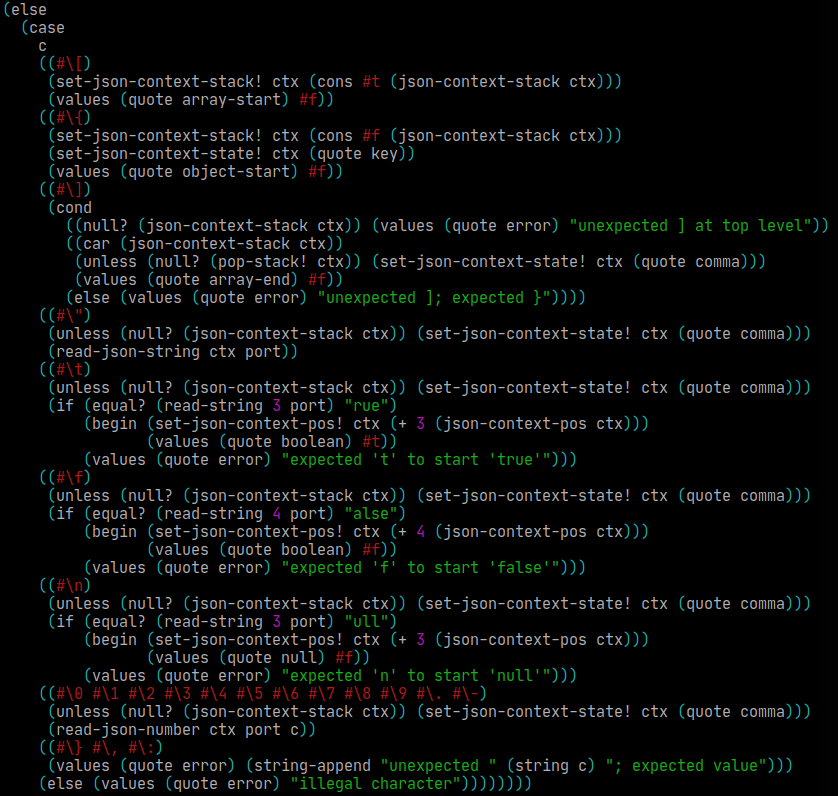
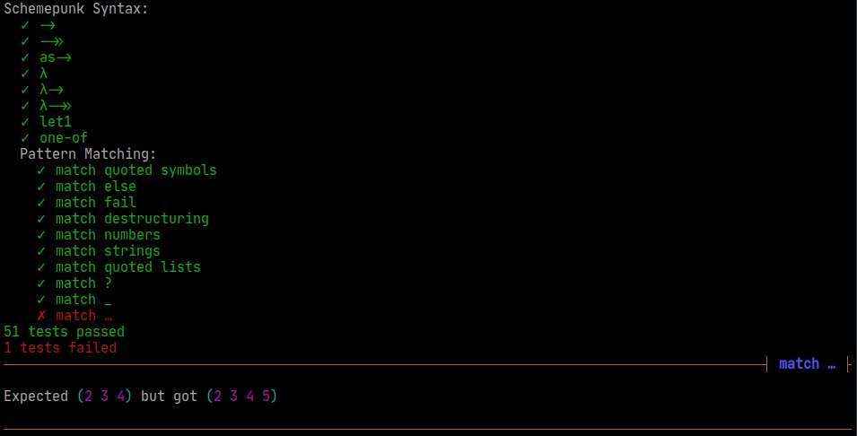

# Schemepunk

A kitchen-sink utility library for several R7RS Scheme dialects.

This library is **unfinished and under heavy development**. It's optimized for
the needs of a few related projects I'm working on, mostly programming language
interpreters and compilers.

To use this library, drop this repository in a `schemepunk` directory in your
project, ideally as a Git submodule. The shell scripts in `scripts` can run unit
tests or Scheme applications in all of Schemepunk's supported Scheme dialects,
and they know how to find and include `.sld` library dependencies, even in
Schemes that don't natively support this.

## Supported Schemes

- [Chibi][chibi]
- [Chicken][chicken]\*
- [Gauche][gauche]
- [Gerbil][gerbil]
- [Kawa][kawa]
- [Larceny][larceny]
- [Sagittarius][sagittarius]

\* Chicken requires these eggs: `r7rs`, `utf8`, `srfi-69`, `srfi-99`,
`srfi-113`, `srfi-128`, `srfi-133`, and `ioctl`. (`ioctl` is only required on
Unix-based OSes.)

## Features

### SRFI Implementations

| SRFI           | Module                    | Description                  |
| -------------- | ------------------------- | ---------------------------- |
| [1][srfi1]     | `(schemepunk list)`       | List library *(plus extras)* |
| [2][srfi2]     | `(schemepunk syntax)`     | `and-let*`                   |
| [8][srfi8]     | `(schemepunk syntax)`     | `receive`                    |
| [26][srfi26]   | `(schemepunk syntax)`     | `cut` and `cute`             |
| [28][srfi28]   | `(schemepunk syntax)`     | `format`                     |
| [64][srfi64]   | `(schemepunk test)`       | Unit tests                   |
| [113][srfi113] | `(schemepunk set)`        | Sets and bags                |
| [125][srfi125] | `(schemepunk hash-table)` | Hash tables                  |
| [128][srfi128] | `(schemepunk comparator)` | Comparators                  |
| [132][srfi132] | `(schemepunk sort)`       | Sorting                      |
| [133][srfi133] | `(schemepunk vector)`     | Vector library               |
| [145][srfi145] | `(schemepunk syntax)`     | Assumptions                  |
| [146][srfi146] | `(schemepunk mapping)`    | Mappings (w/o `(srfi 146 hash)`) |
| [158][srfi158] | `(schemepunk generator)`  | Generators and Accumulators  |
| [173][srfi173] | `(schemepunk hook)`       | Hooks                        |

These modules are aliases for several common SRFIs and R7RS Large libraries,
along with implementations of these libraries for Schemes that don't provide
them by default. The implementations are in the `polyfills` directory; they are
copied from either the SRFI documents or Chibi Scheme.

`(schemepunk list)` is a special case. Because practically every Scheme
implements SRFI 1, Schemepunk doesn't polyfill it, so `(schemepunk list)` is
just an alias for your Scheme's SRFI 1 implementation, plus a few extra list
functions.

This is still useful for portability, because some Schemes (Gerbil) don't use
the standard SRFI import naming conventions; you can't `(import (srfi 1))` in
Gerbil.

`(schemepunk list)` provides these additional list functions:

- `(snoc <list> <elem>)` is a reverse `cons`; it constructs a list by appending
  `elem` to the end of `list`.

- `(map-with-index <fn> <list>)` is like `map`, but it expects `fn` to take two
  arguments. The second argument is the index of the list item.

- `(string-join <delimiter> <strings>)` concatenates `strings` (a list of
  strings) with `delimiter` in between.

- `(list-gen <fn>)` is a generator-style unfold function. `fn` is a lambda that
  takes two arguments, usually named `yield` and `done`. `(yield x)` adds `x` to
  the end of the list being constructed, then recursively calls `fn`. `done` is
  the current list (not a function!), and should be returned to end the
  recursion.

    For example, this reads characters from `(current-input-port)` into a list
    until EOF:

    ```scheme
    (list-gen (lambda (yield done)
                (let ((ch (read-char)))
                  (if (eof-object? ch) done (yield ch)))))
    ```

- `(topological-sort <dependencies>)` sorts a list of dependencies in dependency
  order.

    `dependencies` is an alist, in which the car of each element is a dependency,
    and the cdr of each element is a list of its dependencies, each of which must
    be the car of another element. The list must contain no dependency cycles.

### Utility Macros

`(schemepunk syntax)`

- `λ` is shorthand for `lambda`. Parentheses may be omitted for a single
  argument name: `(λ x (+ x 1))` = `(lambda (x) (+ x 1))`.

- `->`, `->>`, and `as->` are threading macros that behave identically to [their
  equivalents from Clojure][clojure-threading].

- `(let1 <name> <value> <expressions>…)` is shorthand for `let` with a single
  variable.

- `λ->` and `λ->>` are a combination of `lambda` and the `->` and `->>`
  threading macros. They take one unnamed argument. `(λ-> foo bar baz)` is
  equivalent to `(lambda (x) (-> x foo bar baz))`.

- `(match <value> (<pattern> <expr>…)…)` is a hygenic pattern-matching macro,
  based on Alex Shinn's `match-simple.scm`, which is itself based on Andrew
  Wright's `match`. It is a portable subset of the functionality of the `match`
  packages in Chibi and Gauche.

    It supports only the basic features of [`(chibi match)`][chibi-match]. It is
    missing the `=>`, `@`, `$`, `=`, `..1`, `get!`, and `set!` operators, and it
    does not support the symbol `...` as an ellipsis operator (use `___` or `…`
    instead).

- `(match-let ((<pattern> <value>)…) <expressions>…)` uses the
  pattern-matching syntax from `match` as destructuring assignment.

    Related functions `match-let*`, `match-let1`, and `match-letrec` are also
    available.

- `(match-lambda <pattern> <expressions>…)` defines a lambda of one argument
  that matches its argument against a pattern. `matchλ` is an alias.
  `match-lamda*` matches its entire argument list against the pattern.

- `(match-guard ((<pattern> <handler>…)…) <expressions>…)` is a `guard`
  form with pattern-matching. It matches the raised error against each
  `pattern`.

### JSON

`(schemepunk json)`

Minimal JSON parser. Can encode and decode JSON to/from a simple Scheme
representation:

| JSON value         | Scheme representation   |
| ------------------ | ----------------------- |
| `null`             | The symbol `null`       |
| `true`             | The symbol `true`       |
| `false`            | The symbol `false`      |
| `3.14`             | `3.14`                  |
| `"foo"`            | `"foo"`                 |
| `[1, 2, 3]`        | `#(1 2 3)`              |
| `{}`               | `()`                    |
| `{"a": 1, "b": 2}` | `(("a" . 1) ("b" . 2))` |

- `(read-json <port>)` reads one JSON value from a port and returns it. `<port>`
  is optional.

- `(write-json <json> <port>)` writes one JSON value to a port. Anything that
  is not a valid Scheme representation of JSON will be written as `<NOT JSON>`.
  `<port>` is optional.

- `string->json` and `json->string` convert JSON strings to/from their Scheme
  representations.

A simple event-based parser is also available, for performance:

- `(make-json-context)` creates a new context object.

- `(read-json-event <context> <port>)` reads one JSON event from a port. It
  returns two values: `(event payload)`, where `event` is the event type and
  `payload` is an optional value. It takes a context object, which keeps track
  of nesting and object keys. `<port>` is optional.

| Event          | Payload                |
| -------------- | ---------------------- |
| `null`         | `#f`                   |
| `boolean`      | Value (`#t` or `#f`)   |
| `number`       | Value (number)         |
| `string`       | Value (string)         |
| `array-start`  | `#f`                   |
| `array-end`    | `#f`                   |
| `object-start` | `#f`                   |
| `key`          | Key name (string)      |
| `object-end`   | `#f`                   |
| `error`        | Error message (string) |

### Terminal Colors

`(schemepunk term-colors)`

ANSI escape codes for terminal colors.

`(write-colored <color> <string>)` writes `string` to `(current-output-port)`,
with the ANSI escape codes to make it appear as `color`. The escape codes are
not printed if Schemepunk detects that the current terminal does not support
them; this can be overridden by setting the parameter `term-colors-enabled?` to
`#t`.

`<color>` is a color object, which may be one of:

- The 16 colors `black`, `red`, `yellow`, `green`, `blue`, `cyan`, `magenta`,
  `white` `light-black` (or `gray`), `light-red`, `light-yellow`, `light-green`,
  `light-blue`, `light-cyan`, `light-magenta`, and `light-white`.
- The 8 bold colors `bold-black`, `bold-red`, `bold-yellow`, `bold-green`,
  `bold-blue`, `bold-cyan`, `bold-magenta`, and `bold-white`. Depending on your
  terminal, these may look exactly like the light colors, or they may be
  rendered in a bold font.

Colors can also be constructed with `make-color`, which takes any combination of
[SGR parameters][sgr] from these groups:

- Foreground colors `fg-black`, `fg-red`, `fg-light-red`, etc.
- Background colors `bg-black`, `bg-red`, etc.
- Attributes `attr-bold`, `attr-italic`, `attr-negative`, or `attr-underline`.

Order does not matter, and any or all of these can be omitted. `(make-color)`
with no arguments is the color reset escape code, also available as `reset`.

For more fine-grained control, `(write-color <color>)` writes a single ANSI
escape code. Make sure to reset with `(reset-color)` after writing!

### Pretty Printing

`(schemepunk debug)`

Prints Scheme data and JSON in an indented, colorized format. Adapts to the
terminal width.



The internals of this library are complex and likely to change, but the most
relevant functions are `write-debug` and `write-json`, which write Scheme data
or JSON to `(current-output-port)`. `write-debug` is extremely useful as an
alternative to `display`/`write` for print-statement debugging, because it
provides sensible indentation and syntax highlighting.

There is also a `(schemepunk debug report)` sublibrary which prints error
reports in a similar style to Rust. It is incomplete and I am currently
reworking its API, so it is not documented here.

### Test Runner

`(schemepunk test)`

A unit test framework modeled after Javascript's [Mocha][mocha]. Although its
preferred API differs from [SRFI 64][srfi64], it includes compatibility macros
that allow it to run SRFI 64 tests without modifications.



Test suites are defined as `(test-group <name> <tests>…)`, where `<tests>` is
one or more `(test <name> <expressions>…)` clauses. Test suite files have the
`.test.scm` extension.

Tests are made up of assertions. `(schemepunk test)` provides these assertion
functions:

- `(assert-true <message> <value>)` *(`message` is optional)*
- `(assert-false <message> <value>)` *(`message` is optional)*
- `(assert-eq <actual> <expected>)`
- `(assert-eqv <actual> <expected>)`
- `(assert-equal <actual> <expected>)`
- `(assert-approximate <actual> <expected> <error>)`
- `(fail <message>)`

`(end-test-runner)` prints a report of passed/failed tests and ends the process
with the approporate return code, but you shouldn't need to call this on your
own. The test runner scripts in `scripts` take care of finding all `.test.scm`
files in the project, running all of them, and running `(end-test-runner)` at
the end.

The `Makefile` contains usage examples for the test runner scripts. Finding the
test files and running the tests are split into two separate scripts, because
some of my projects need to search only specific subdirectories for test files.

### Datalog (WIP)

`(schemepunk datalog)`

Simple Datalog logic programming library. Still unfinished, not much to see
here. So far, it supports semi-naive evaluation and stratified negation.

## License

Copyright &copy; 2020 Adam Nelson

Schemepunk is distributed under the [Blue Oak Model License][blue-oak]. It is
a MIT/BSD-style license, but with [some clarifying improvements][why-blue-oak]
around patents, attribution, and multiple contributors.

Schemepunk also includes MIT/BSD-licensed code from the following authors:

- SRFI 113, 125, 132, and 133 implementations are taken from Chibi Scheme,
  copyright &copy; 2009-2018 Alex Shinn
- SRFI 128 implementation copyright &copy; 2015 John Cowan
- SRFI 146 implementation copyright &copy; 2016-2017 Marc Nieper-Wißkirchen
- SRFI 158 implementation copyright &copy; 2015 Shiro Kawai, John Cowan, Thomas
  Gilray

[gauche]: http://practical-scheme.net/gauche/
[chibi]: http://synthcode.com/scheme/chibi/
[kawa]: https://www.gnu.org/software/kawa/
[gerbil]: https://cons.io/
[larceny]: http://www.larcenists.org/
[chicken]: http://call-cc.org/
[sagittarius]: https://bitbucket.org/ktakashi/sagittarius-scheme/wiki/Home
[srfi1]: https://srfi.schemers.org/srfi-1/
[srfi2]: https://srfi.schemers.org/srfi-2/
[srfi8]: https://srfi.schemers.org/srfi-8/
[srfi26]: https://srfi.schemers.org/srfi-26/
[srfi28]: https://srfi.schemers.org/srfi-28/
[srfi64]: https://srfi.schemers.org/srfi-64/
[srfi113]: https://srfi.schemers.org/srfi-113/
[srfi125]: https://srfi.schemers.org/srfi-125/
[srfi128]: https://srfi.schemers.org/srfi-128/
[srfi132]: https://srfi.schemers.org/srfi-132/
[srfi133]: https://srfi.schemers.org/srfi-133/
[srfi145]: https://srfi.schemers.org/srfi-145/
[srfi146]: https://srfi.schemers.org/srfi-146/
[srfi158]: https://srfi.schemers.org/srfi-158/
[srfi173]: https://srfi.schemers.org/srfi-173/
[clojure-threading]: https://clojure.org/guides/threading_macros
[chibi-match]: http://synthcode.com/scheme/chibi/lib/chibi/match.html
[sgr]: https://en.wikipedia.org/wiki/ANSI_escape_code#SGR_parameters
[mocha]: https://mochajs.org/
[blue-oak]: https://blueoakcouncil.org/license/1.0.0
[why-blue-oak]: https://writing.kemitchell.com/2019/03/09/Deprecation-Notice.html
