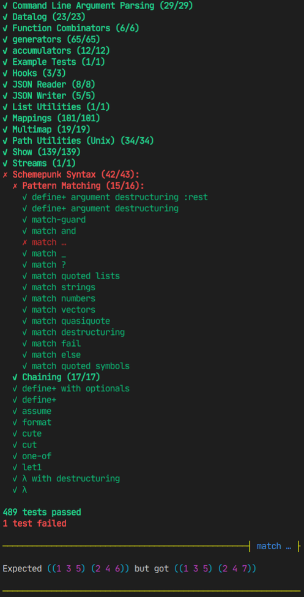

# Schemepunk

A kitchen-sink utility library for several R7RS Scheme dialects.

This library is **unfinished and under heavy development**. It's optimized for
the needs of a few related projects I'm working on, mostly programming language
interpreters and compilers.

To use this library, drop this repository in a `schemepunk` directory in your
project, ideally as a Git submodule. The shell scripts in `scripts` can run unit
tests or Scheme applications in all of Schemepunk's supported Scheme dialects,
and they know how to find and include `.sld` library dependencies, even in
Schemes that don't natively support this.

## Supported Schemes

- [Chibi][chibi]
- [Chicken][chicken]\*
- [Gauche][gauche]
- [Gerbil][gerbil]
- [Kawa][kawa]
- [Larceny][larceny]
- [Sagittarius][sagittarius]

\* Chicken requires these eggs: `r7rs`, `utf8`, `box`, `srfi-41`, `srfi-69`,
`srfi-99`, `srfi-113`, `srfi-128`, `srfi-133`, and `ioctl`. (`ioctl` is only
required on Unix-based OSes.)

Schemepunk can also be built as a Chicken egg. Just run `chicken-install`
(possibly with `-sudo`) in the repo's root directory.

## Modules

- [`(schemepunk box)` - Boxes](#schemepunk-box)
- [`(schemepunk btree)` - Persistent B-trees](#schemepunk-btree)
- [`(schemepunk command)` - Command-line argument parsing](#schemepunk-command)
- [`(schemepunk comparator)` - Comparators](#schemepunk-comparator)
- [`(schemepunk datalog)` - Logic programming (WIP)](#schemepunk-datalog)
- [`(schemepunk function)` - Functional programming utilities](#schemepunk-function)
- [`(schemepunk generator)` - Generators and accumulators](#schemepunk-generator)
- [`(schemepunk hash-table)` - Hash tables](#schemepunk-hash-table)
- [`(schemepunk hook)` - Hooks](#schemepunk-hook)
- [`(schemepunk json)` - JSON](#schemepunk-json)
- [`(schemepunk list)` - List utilities](#schemepunk-list)
- [`(schemepunk mapping)` - Persistent mappings](#schemepunk-mapping)
- [`(schemepunk multimap)` - Multimaps](#schemepunk-multimap)
- [`(schemepunk path)` - File path utilities](#schemepunk-path)
- [`(schemepunk random)` - Random number generation](#schemepunk-random)
- [`(schemepunk set)` - Sets and bags](#schemepunk-set)
- [`(schemepunk show)` - Monadic text formatting](#schemepunk-show)
    - [`(schemepunk show debug)` - Simple pretty-printing](#schemepunk-show-debug)
    - [`(schemepunk show report)` - Stylish error reports](#schemepunk-show-report)
- [`(schemepunk sort)` - Sorting](#schemepunk-sort)
- [`(schemepunk stream)` - Streams](#schemepunk-stream)
- [`(schemepunk string)` - String utilities](#schemepunk-string)
- [`(schemepunk syntax)` - Utility macros](#schemepunk-syntax)
- [`(schemepunk term-colors)` - ANSI terminal colors](#schemepunk-term-colors)
- [`(schemepunk test)` - Unit test framework](#schemepunk-test)
- [`(schemepunk vector)` - Vector library](#schemepunk-vector)

### `(schemepunk box)`

Polyfilled alias for [SRFI 111 (Boxes)][srfi111]. Exports one additional
procedure:

- `(update-box! <box> <proc>)` is equivalent to
  `(set-box! <box> (<proc> (unbox <box>)))`.

### `(schemepunk btree)`

An original implementation of persistent B-trees, used to implement `(schemepunk
mapping)` on all Schemes except Gauche¹.

Schemepunk's B-tree mappings are frequently 2-3 times faster than the
red-black-tree reference implementation of SRFI 146, and significantly faster
when constructing large mappings. This library includes linear-update
`!`-suffixed mutation procedures, for yet another performance boost.

You usually want to use this module through `(schemepunk mapping)`, but, if you
want to use the B-tree data structure directly, this module provides these
low-level procedures:

- `(btree <comparator> <max-size>)`
- `(btree? <btree>)`
- `(btree-key-comparator <btree>)`
- `(btree-empty? <btree>)`
- `(btree-copy <btree>)`
- `(btree-ref <key> <value> <failure-proc>)` *(`failure-proc` is optional)*
- `(btree-set <btree> <key> <value>)`
- `(btree-set! <btree> <key> <value>)`
- `(btree-delete <btree> <key>)`
- `(btree-delete! <btree> <key>)`
- `(btree-pop <btree> <key>)` *(returns two values: `(key . value)` and modified btree)*
- `(btree-pop! <btree> <key>)` *(returns one value: `(key . value)`)*
- `(btree-fold <fn> <seed> <btree>)`
- `(btree-fold-right <fn> <seed> <btree>)`
- `(alist->btree <alist> <comparator> <max-size>)`
- `(btree->alist <btree>)`
- `(btree-subset? <value-comparator> <btree1> <btree2>)`
- `(btree=? <value-comparator> <btree1> <btree2>)`
- `(btree<? <value-comparator> <btree1> <btree2>)`
- `(btree-hash <value-comparator> <btree>)`
- `(make-btree-comparator <value-comparator>)`
- `btree-comparator`

¹ _B-trees are faster than most Schemes' SRFI 146, but Gauche's `<tree-map>` is
usually even faster._

### `(schemepunk command)`

A command-line argument parser, loosely based on Chibi Scheme's
[`(chibi app)`][chibi-app]. The parser procedures take _app specifications_,
which are nested alists. For example, the zoo demo from the `(chibi app)`
documentation can be written like this for `(schemepunk command)`:

```scheme
'((name "Zookeeper Application")
  (doc "Example application from (chibi app) documentation, adapted for \
        (schemepunk command).")
  (copyright "Copyright (c) 2020")
  (options
    (animals
      (type (list symbol))
      (doc "list of animals to act on (default all)"))
    (lions
      (short #\l)
      (doc "also apply the action to lions")))
  (commands
    (feed
      (short-doc "feed the animals")
      (doc-args <animals> ...))
    (wash
      (short-doc "wash the animals")
      (doc-args <animals> ...)
      (options (soap)))
    (help
      (short-doc "print help")))
  (require-command #t))
```

`(schemepunk command)` supports both `-` short options and `--` long options.
Short options can be grouped: `-xyz` = `-x -y -z`. Values after option names can
follow either a space or `=`. Git-style commands, with their own documentation
and option lists, are also supported.

#### Procedures

- `(run-application <spec> <command-line> <proc>)` parses the list of
  command-line arguments `<command-line>` using the specification `<spec>`.
  The first element of `<command-line>` should be the executable name.

    If parsing is successful, `<proc>` is tail-called with five arguments:

    - `options`, an alist of the `-` or `--` options passed to the app
    - `args`, a list of all non-option and non-command arguments passed to the
      app, as strings
    - `command`, the command name passed to the app, or `#f` if there is no
      command
    - `command-options`, an alist of all options that occurred after the command
      name
    - `command-args`, a list of all non-option arguments that occurred after the
      command name, as strings

    If parsing fails, a usage message is printed to `(current-error-port)`, and
    then Scheme is terminated with `(exit 1)`.

- `(parse-app <spec> <command-line>)` parses the list of command-line arguments
  `<command-line>` using the specification `<spec>`, and returns five values,
  corresponding to the five arguments passed to `run-application`'s `<proc>`. If
  parsing fails, it will raise an error object for which `command-error?` is
  `#t`.

- `(app-usage <spec> <command-line>)` is a `(schemepunk show)` formatter that
  prints a usage message for the app specification `<spec>`. The executable name
  is taken from the first element of the list `<command-line>`.

- `(command-usage <spec> <command> <command-line>)` is a `(schemepunk show)`
  formatter that prints a usage message for the command `<command>` in the app
  specification `<spec>`. The executable name is taken from the first element of
  the list `<command-line>`.

- `app-help` and `command-help` are like `app-usage` and `command-usage`, but
  also include `name`, `doc`, and `copyright` if they are present in the
  specification.

    

- `(command-error? <datum>)` is a type predicate for the error objects raised by
  `parse-app`.

#### App specification

All alist keys are optional; the empty specification `'()` is valid but has no
documentation and accepts no options.

- `name` - name of the application, displayed at the start of the app's help
  text
- `doc` - documentation paragraph, displayed at the start of the app's help text
- `doc-args` - symbols or strings that describe the app's arguments in usage
  text; e.g., `<input-file> "[<output-file>]"`
- `copyright` - copyright message displayed at bottom of help text
- `options` - alist of options for the app; each option's key is also its
  default long option name
- `commands` - alist of commands for the app; each command's key is also its
  name
- `require-command` - if `#t`, app exits with an error if no command is provided
- `default-help-option` - if `#t`, an option is added with long name `--help`
  and short name `-h` that, if present, causes `run-application` to print the
  app's help text and exit
- `default-help-command` - if `#t`, a command named `help` is added that, if
  selected and passed a command name as its only argument, causes
  `run-application` to display that command's help text and exit

##### Option

- `type` - data type of the option's value, defaults to `boolean`; options are
  `boolean`, `symbol`, `char`, `string`, `integer`, `real`, `sexp`, and
  `(list <type>)`
- `long` - long option aliases for this option (symbols or strings)
- `short` - short option aliases for this option (chars)
- `doc` - description of this option, displayed in usage text
- `doc-value` - name of the option's value, displayed in usage text, defaults to
  value of `type`

##### Command

- `short-doc` - documentation shown in the app's usage text
- `doc` - longer documentation shown in the command's usage text
- `doc-args` - symbols or strings that describe the command's arguments in usage
  text; e.g., `<input-file> "[<output-file>]"`
- `options` - alist of options for the command; each option's key is also its
  default long option name

### `(schemepunk comparator)`

Polyfilled alias for [SRFI 128 (Comparators)][srfi128] with [SRFI 162
(Comparators sublibrary)][srfi162] extensions. These comparators are used by all
of Schemepunk's ordered data structures: sets, bags, hash tables, mappings, and
multimaps.

In addition to SRFIs 128 and 162, this module exports several extra procedures,
macros, and comparators:

- `symbol-comparator` is a default comparator for symbols.

- `number-comparator` is a default comparator for numbers that is more general
  than SRFI 162's `real-comparator`.

- `(make-sum-comparator <comparators>…)` creates a comparator for the _sum type_
  of the types represented by each comparator in `<comparators>`. For example,
  `(make-sum-comparator boolean-comparator number-comparator string-comparator)`
  returns a comparator for values that may be either booleans, numbers, or
  strings.

- `(hash-lambda (<param>) <body>…)` is equivalent to
  `(lambda (<param>) <body>…)`, except that it takes and ignores an optional
  second argument. This macro should be used to define hash functions. Some
  Schemes' SRFI 128 or SRFI 69 implementations expect hash functions to take one
  parameter, others expect two, and this is the only way to write hash functions
  that are compatible with all of them.

- `(identity-hash <x>)` is a reference-identity-based hash function, used by
  `eq-comparator`. It should always return different hashes for values that are
  not `eq?`. This is a primitive operator that cannot be implemented portably,
  so it is always an alias for the host Scheme's identity hash function.

- `(identity<? <x> <y>)` is an identity-based ordering function, used by
  `eq-comparator`. It compares the `identity-hash` of `<x>` and `<y>`.

### `(schemepunk datalog)`

WIP simple Datalog logic programming library. Still unfinished, not much to see
here. So far, it supports semi-naive evaluation and stratified negation.

### `(schemepunk function)`

Combinators commonly used in functional languages like Haskell or ML.

- `(identity <x>)` returns `<x>`.

- `(const <x>)` returns a procedure that takes one argument, ignores it, and
  returns `<x>`.

- `(flip <f>)` takes a procedure of two arguments `<f>`, and returns a new
  procedure `(g x y)` that calls `(<f> y x)`.

- `(compose <fs>…)` composes procedures right-to-left: `(compose f g)` returns
  a procedure `(composed x)` that calls `(f (g x))`.

- `(bind <fs>…)` composes procedures left-to-right: `(bind f g)` returns a
  procedure `(composed x)` that calls `(g (f x))`.

- `(complement <pred?>)` takes a predicate `<pred?>` and returns its complement
  (a predicate that always returns the opposite boolean value).

### `(schemepunk generator)`

Polyfilled alias for [SRFI 158 (Generators and Accumulators)][srfi158]. Exports
one additional procedure:

- `(gfork <gen>)` returns two values, both of which are generators that produce
  the same sequence of values as `<gen>`.

### `(schemepunk hash-table)`

Polyfilled alias for [SRFI 125 (Intermediate Hash Tables)][srfi125]. No
additional exports. Uses comparators from `(schemepunk comparator)`.

### `(schemepunk hook)`

Polyfilled alias for [SRFI 173 (Hooks)][srfi173]. No additional exports.

### `(schemepunk json)`

Minimal JSON parser. Can encode and decode JSON to/from a simple Scheme
representation:

| JSON value         | Scheme representation   |
| ------------------ | ----------------------- |
| `null`             | The symbol `null`       |
| `true`             | The symbol `true`       |
| `false`            | The symbol `false`      |
| `3.14`             | `3.14`                  |
| `"foo"`            | `"foo"`                 |
| `[1, 2, 3]`        | `#(1 2 3)`              |
| `{}`               | `()`                    |
| `{"a": 1, "b": 2}` | `(("a" . 1) ("b" . 2))` |

- `(read-json <port>)` reads one JSON value from a port and returns it. `<port>`
  is optional.

- `(write-json <json> <port>)` writes one JSON value to a port. Anything that
  is not a valid Scheme representation of JSON will be written as `<NOT JSON>`.
  `<port>` is optional.

- `string->json` and `json->string` convert JSON strings to/from their Scheme
  representations.

A simple event-based parser is also available, for performance:

- `(make-json-context)` creates a new context object.

- `(read-json-event <context> <port>)` reads one JSON event from a port. It
  returns two values: `(event payload)`, where `event` is the event type and
  `payload` is an optional value. It takes a context object, which keeps track
  of nesting and object keys. `<port>` is optional.

| Event          | Payload                |
| -------------- | ---------------------- |
| `null`         | `#f`                   |
| `boolean`      | Value (`#t` or `#f`)   |
| `number`       | Value (number)         |
| `string`       | Value (string)         |
| `array-start`  | `#f`                   |
| `array-end`    | `#f`                   |
| `object-start` | `#f`                   |
| `key`          | Key name (string)      |
| `object-end`   | `#f`                   |
| `error`        | Error message (string) |

### `(schemepunk list)`

Alias for [SRFI 1 (List Library)][srfi1]. Because all supported Schemes include
this SRFI, there is no polyfill.

In addition to SRFI 1, this module exports several extra procedures:

- `(snoc <list> <elem>)` is a reverse `cons`; it constructs a list by appending
  `elem` to the end of `list`.

- `(map-with-index <fn> <list>)` is like `map`, but it expects `fn` to take two
  arguments. The second argument is the index of the list item.

- `(intercalate <delimiter> <list>)` constructs a new list by inserting
  `<delimiter>` between each pair of elements in `<list>`.

- `(list-gen <fn>)` is a generator-style unfold. `fn` is a lambda that takes
  two arguments, usually named `yield` and `done`. `(yield x)` adds `x` to the
  end of the list being constructed, then recursively calls `fn`. `done` is the
  current list (not a procedure!), and should be returned to end the recursion.

    For example, this reads characters from `(current-input-port)` into a list
    until EOF:

    ```scheme
    (list-gen (lambda (yield done)
                (let ((ch (read-char)))
                  (if (eof-object? ch) done (yield ch)))))
    ```

- `(fold-by-pairs <fn> <seed> <list>)` is like `fold`, but reads `list` two
  elements at a time. It calls `fn` with three arguments. It raises an error if
  `list` does not contain an even number of elements.

- `(fold-right-by-pairs <fn> <seed> <list>)` is `fold-by-pairs` in reverse.

- `(topological-sort <dependencies>)` sorts a list of dependencies in dependency
  order.

    `dependencies` is an alist, in which the car of each element is a dependency,
    and the cdr of each element is a list of its dependencies, each of which must
    be the car of another element. The list must contain no dependency cycles.

### `(schemepunk mapping)`

Polyfilled alias for [SRFI 146 (Mappings)][srfi146]. No additional exports.
Uses comparators from `(schemepunk comparator)`. Does not include `(srfi 146
hash)`.

All Schemes except Gauche use Schemepunk's implementation, which is based on
`(schemepunk btree)`. Gauche's `(srfi 146)` is native and faster than
`(schemepunk btree)`, so it is used when possible.

### `(schemepunk multimap)`

Mappings from one key to a set of values, based on `(schemepunk mapping)` and
`(schemepunk set)`. Uses comparators from `(schemepunk comparator)`.

#### Constructors

- `(multimap <key-comparator> <value-comparator>)` constructs a new, empty
  multimap. A multimap requires comparators for both keys and values.
- `(multimap-copy <mmap>)` returns a distinct copy of `<mmap>`.

#### Accessors

- `(multimap? <datum>)` is the type predicate for multimaps.
- `(multimap-key-comparator <mmap>)`  and `(multimap-value-comparator <mmap>)`
  return the comparators used by `<mmap>`.
- `(multimap-ref <mmap> <key>)` returns the set of values for `<key>` in
  `<mmap>`.
- `(multimap->mapping <mmap>)` returns the underlying mapping of `<mmap>`. Its
  keys are the same as `<mmap>`'s, and its values are sets.
- `(multimap-contains? <mmap> <value>)` returns `#t` if `<mmap>` contains the
  value `<value>` in any key's value set, and `#f` otherwise.
- `(multimap-contains-key? <mmap> <key>)` returns `#t` if `<mmap>` contains the
  key `<key>`, `#f` otherwise.
- `(multimap-keys <mmap>)` returns a list of the keys in `<mmap>`.
- `(multimap-values <mmap>)` returns a list of all values in all value sets in
  `<mmap>`.
- `(multimap-value-sets <mmap>)` returns a list of the value sets in `<mmap>`.
- `(multimap-key-count <mmap>)` returns the number of keys in `<mmap>`.
- `(multimap-value-count <mmap>)` returns the total number of values in all
  value sets in `<mmap>`.
- `(multimap-empty? <mmap>)` returns `#t` if `<mmap>` is empty, `#f` otherwise.

#### Mutators

- `(multimap-adjoin <mmap> <key> <value>)` and
  `(multimap-adjoin! <mmap> <key> <value>)` return a new multimap with `<value>`
  added to the set of values for `<key>` in `<mmap>`. `multimap-adjoin!` mutates
  `<mmap>` in-place before returning it.
- `(multimap-adjoin-set <mmap> <key> <vals>)` and
  `(multimap-adjoin-set! <mmap> <key> <vals>)` return a new multimap with all
  values in the set `<vals>` added to the set of values for `<key>` in `<mmap>`.
  `multimap-adjoin-set!` mutates `<mmap>` in-place before returning it.
- `(multimap-delete-key <mmap> <key>)` and `(multimap-delete-key! <mmap> <key>)`
  return a new multimap with all values for `<key>` in `<mmap>` removed.
  `multimap-delete-key!` mutates `<mmap>` in-place before returning it.
- `(multimap-delete-value <mmap> <key> <value>)` and
  `(multimap-delete-value! <mmap> <key> <value>)` return a new multimap with
   `<value>` removed from the set of values for `<key>` in `<mmap>`.
  `multimap-delete-value!` mutates `<mmap>` in-place before returning it.
- `(multimap-clear! <mmap>)` mutates `<mmap>` by removing all keys and values.
- `(multimap-union <lhs> <rhs>)` and `(multimap-union! <lhs> <rhs>)` return a
  multimap containing all key/value pairs from both `<lhs>` and `<rhs>`. If both
  multimaps contain the same key, the returned multimap will contain the union
  of both maps' value sets for that key. `multimap-union!` mutates `<lhs>`
  in-place before returning it.
- `(multimap-difference <lhs> <rhs>)` returns a multimap that is the result of
  removing all key/value pairs in `<rhs>` from `<lhs>`.

### `(schemepunk path)`

Procedures for manipulating file path strings. These use the path format of the
current OS; there are separate implementations for Windows and Unix-like OSes.

- `(current-directory)` returns the current working directory.
- `(path-join <path> <suffix>…)` appends each `<suffix>` to the root path
  `<path>` using the OS path separator.
- `(path-normalize <path>)` converts `<path>` to an equivalent, normalized form
  by removing any unnecessary `.` or `..` elements, correcting path separators,
  and (on Windows) adding a missing drive name.
- `(path-root? <path>)` returns whether `<path>` is an absolute root path (e.g.,
  `/` on Unix or `C:\` on Windows).
- `(path-directory <path>)` returns the path of the parent directory of
  `<path>`.
- `(path-strip-directory <path>)` returns the final path element of `<path>`.
- `(path-absolute? <path>)` returns whether `<path>` is an absolute path.
- `(path-relative? <path>)` returns whether `<path>` is a relative path.
- `(relative-path->absolute-path <path>)` converts a relative path to an
  absolute path, assuming that the path is relative to `(current-directory)`.

### `(schemepunk random)`

Generates random numbers.

- `(random-integer <max>)` generates a random exact integer between `0` and
  `<max>`, exclusive.
- `(random-real)` generates a random real number between `0` and `1`.

### `(schemepunk set)`

Polyfilled alias for [SRFI 113 (Sets and Bags)][srfi113]. No additional exports.
Uses comparators from `(schemepunk comparator)`.

### `(schemepunk show)`

A full-featured, original implementation of [SRFI 166 (Monadic Text
Formatting)][srfi166]. Supports colorized pretty-printing, Unicode-aware
alignment and truncation, columns, tables, and more.

This implementation is based on SRFI 158 generators. A formatter is a procedure
that takes a mapping of state variables and returns a generator of spans. A span
is a record containing a string, a type (`text`, `whitespace`, or `newline`) and
a color.

Schemepunk's SRFI 166 includes several additional operators and submodules. The
additional exports, grouped by submodule, are as follows:

#### `(schemepunk show base)`

- `(call-with-output-generator <fmt> <proc>)` is like `call-with-output`, but
  passes a generator to `<proc>` instead of a string.

#### `(schemepunk show color)`

Includes ANSI light colors: `as-light-red`, `as-light-blue`, `as-light-green`,
`as-light-cyan`, `as-light-yellow`, `as-light-magenta`, `as-light-white`,
`as-light-black`, and `as-gray` (alias for `as-light-black`).

#### `(schemepunk show columnar)`

- `(boxed <fmts>…)` returns a formatter that draws a box around `<fmts>` using
  box drawing characters. `boxed/double` and `boxed/ascii` are variants that
  draw a double-line box and an ASCII-only box.

- `(boxed/custom <color> <h> <v> <nw> <ne> <sw> <se> <fmts>…)` is the box
  drawing formatter used by `boxed`.

    - `<color>` is a procedure that takes a formatter and returns a procedure.
      It is used to apply a color to the box outline. For example, if `<color>`
      is `as-red`, the box outline will be red. If the box should not be
      colored, `<color>` should be `each`.
    - `<h>` and `<v>` are the horizontal and vertical line characters used to
      draw the box.
    - `<nw>`, `<ne>`, `<sw>`, and `<se>` are the corner characters used to draw
      the box. They are the top-left, top-right, bottom-left, and bottom-right
      corners, respectively.

- `(collapsed-if-one-line <fmts>…)` returns a formatter that prints `<fmts>`
  with all adjacent whitespace collapsed to single spaces, as in `wrapped`, if
  and only if the entire collapsed string would fit in a single line. Otherwise,
  it prints `<fmts>` unchanged.

#### `(schemepunk show pretty)`

- `pretty-json` and `pretty-json-color` are equivalents to `pretty` and
  `pretty-color` for `(schemepunk json)`-compatible JSON data structures. They
  print JSON.

- `indent-size` is a state variable for the number of spaces in a single
  pretty-printing indentation level. Defaults to `2`.

#### `(schemepunk show debug)`

A simple interface to `(schemepunk show pretty)` for print-statement debugging.

- `(write-debug <datum>)` prints `<datum>` to `(current-output-port)` using
  `pretty-color`, then prints a newline.

    

- `(write-debug-json <json>)` prints `<json>` to `(current-output-port)` using
  `pretty-json-color`, then prints a newline.

#### `(schemepunk show report)`

Formatters for detailed error reports, similar to the error reports in languages
like Rust and Elm. `(schemepunk test)` uses this to print test errors.

- `(reported <title> <fmts>…)` is a formatter that prints a header line with
  `<title>` embedded into it, followed by `<fmts>`.

    

- `report-line` is a formatter that prints a single horizontal line the width of
  `width`, colored to match `reported`'s headers. Use this at the end of a
  sequence of reports.

- `(wrapped/blocks <fmts>…)` is a variant of `wrapped` that handles newlines in
  subformatters. If a non-string formatter in `<fmts>` contains a newline or is
  longer than 2/3 of `width`, that formatter is broken out into its own
  paragraph, without wrapping, with two newlines above and below it.

    Can be used in reports to include pretty-printed Scheme data in wrapped text
    blocks; the Scheme data will appear as either inline code or standalone code
    blocks, depending on its size.

- `(code-snapshot <filename> <source> <line-numbers?> <annotations>…)` prints a
  snippet of the string or formatter `<source>`, adjusted to fit within the
  terminal, with annotations pointing to specific lines and columns. It can
  print line-and-column error traces with multiple messages, in the style of
  Rust:

    

    `<annotations>` is composed of one or more five-element lists:
    `(<line> <start-col> <end-col> <color> <message>)`. `<line>` is the 0-based
    line of the annotation, and `<start-col>`-`<end-col>` are the 0-based column
    range of the annotation. `<color>` is a color formatter procedure, like
    `as-red`, and should be `each` if the annotation is not colored. `<message>`
    is the annotation message itself, and can be a string or `#f`. If
    `<message>` is `#f`, the annotation will be an underline with no message.

#### `(schemepunk show span)`

Defines the span data structure. Formatters return generators of spans. Spans
include color data that is not part of their text content. They can also be
marked as whitespace or newlines, which speeds up operations like `wrapped` and
is used by the pretty-printing indentation algorithm.

- `(span? <datum>)` is a type predicate for spans.
- `(span-type <span>)` returns the type of `<span>` (`text`, `whitespace`, or
  `newline`).
- `(span-text <span>)` returns the text content of `<span>` as a string.
- `(span-color <span>)` returns the color of `<span>` (a
  `(schemepunk term-color)` ANSI color, or `#f`).
- `(text-span <str> <color>)` constructs a `text` span from a string. `<color>`
  is optional and defaults to `#f`.
- `(whitespace-span <str>)` constructs a `whitespace` span from a string.
  `<str>` is optional and defaults to `" "`.
- `(newline-span <str>)` constructs a `newline` span from a string. `<str>` is
  optional and defaults to the string printed by `(newline)`.
- `(span-map-text <proc> <span>)` returns a copy of `<span>` whose text content
  is the result of applying `<proc>` to `(span-text <span>)`.
- `(span-with-color <span> <color>)` returns a copy of `<span>` with the color
  `<color>`.
- `(char-generator->span-generator <gen> <word-separator?> <read-ansi-escapes?>)`
  takes a generator of chars (`<gen>`) and returns a generator of spans. Any
  `#\newline` character becomes a `newline` span, any group of characters for
  which `word-separator?` returns true becomes a `whitespace` span, and all
  groups of characters between these become `text` spans.

    - `<word-separator?>` is an optional predicate and defaults to
      `char-whitespace?`.
    - `<read-ansi-escapes?>` is an optional boolean and defaults to `#f`. If it is
      `#t`, this procedure will check for ANSI escapes in the character stream
      and include them in the generated spans as color values.
- `(write-span <span> <port>)` writes the text of `<span>` to `<port>`, wrapped
  in ANSI escapes if the span has a color. `<port>` is optional and defaults to
  `(current-output-port)`.

### `(schemepunk sort)`

Polyfilled alias for [SRFI 132 (Sort Libraries)][srfi132]. No additional
exports.

### `(schemepunk stream)`

Alias for [SRFI 41 (Streams)][srfi41]. Because all supported Schemes include
this SRFI, there is no polyfill. No additional exports.

### `(schemepunk string)`

Polyfilled alias for [SRFI 152 (String Library (Reduced))][srfi152]. The
polyfill is not a full SRFI 152 implementation; it imports either
[SRFI 13][srfi13] or [SRFI 130][srfi130], then fills in the missing SRFI 152
procedures. No additional exports.

**Compatibility note:** The `string<?` and `string-ci<?` family of comparison
procedures in `(schemepunk string)` do not strictly match the specification.
They are simple reexports of the matching procedures from `(scheme base)` and
`(scheme char)`, and as such they only accept exactly two arguments. This was
done because, in some Schemes, it is an error to import two different
definitions with the same name. If they were defined according to the
specification, it would be impossible to import `(scheme base)` and `(schemepunk
string)` in the same module without excluding these imports.

### `(schemepunk syntax)`

A collection of utility macros. Includes [SRFI 2 (`and-let*`)][srfi2], [SRFI 8
(`receive`)][srfi8], [SRFI 26 (`cut` and `cute`)][srfi26], [SRFI 28
(`format`)][srfi28], [SRFI 145 (`assume`)][srfi145], [SRFI 156 (`is`)][srfi156],
and [SRFI 197 (`chain`)][srfi197].

- `λ` is shorthand for `lambda`. Parentheses may be omitted for a single
  argument name: `(λ x (+ x 1))` = `(lambda (x) (+ x 1))`. Arguments may contain
  destructuring assigments (see `match`).

- `chain` is similar to [Clojure threading macros][clojure-threading], but with
  `_` as an explicit argument marker. This macro is fully defined in
  [SRFI 197][srfi197].

    ```scheme
    (chain x (foo y _) (bar _ z)) ; => (bar (foo y x) z)
    ```

- `chain-lambda` defines a lambda using a `chain` pipeline. `(chain-lambda (foo
  y _) (bar _ z))` = `(lambda (x) (chain x (foo y _) (bar _ z)))`. `λ=>` is
  shorthand for `chain-lambda`.

- `(let1 <name> <value> <expressions>…)` is shorthand for `let` with a single
  variable.

- `(match <value> (<pattern> <expr>…)…)` is a hygenic pattern-matching macro,
  based on Alex Shinn's `match-simple.scm`, which is itself based on Andrew
  Wright's `match`. It is a portable subset of the functionality of the `match`
  packages in Chibi and Gauche.

    It supports only the basic features of [`(chibi match)`][chibi-match]. It is
    missing the `=>`, `@`, `$`, `=`, `..1`, `get!`, and `set!` operators, and it
    does not support the symbol `...` as an ellipsis operator (use `___` or `…`
    instead).

- `(match-let ((<pattern> <value>)…) <expressions>…)` uses the
  pattern-matching syntax from `match` as destructuring assignment.

    Related functions `match-let*`, `match-let1`, and `match-letrec` are also
    available.

- `(match-lambda (<pattern> <expr>…)…)` defines a lambda of one argument
  that matches its argument against one or more patterns. `matchλ` is an alias.
  `match-lamda*` matches its entire argument list against the patterns.

- `(match-guard ((<pattern> <handler>…)…) <expressions>…)` is a `guard`
  form with pattern-matching. It matches the raised error against each
  `pattern`.

- `(define+ (<name> <params>… :optional <optional-params>… :rest <rest-param>) <body>…)`
  is a form of `define` that supports destructuring assignment (as in `λ`) and
  optional parameters. It uses Gauche's syntax for optional and rest parameters.
  The `:optional` and `:rest` sections are optional.  Each `<optional-param>`
  may be a symbol or a list `(<name> <default>)`. The `<params>` and
  `<rest-param>` sections may be `match` patterns.

### `(schemepunk term-colors)`

ANSI escape codes for terminal colors.

`(write-in-color <color> <string>)` writes `string` to `(current-output-port)`,
with the ANSI escape codes to make it appear as `color`. The escape codes are
not printed if Schemepunk detects that the current terminal does not support
them; this can be overridden by setting the parameter `term-colors-enabled?` to
`#t`.

`<color>` is a color object, which may be one of:

- The 16 colors `black`, `red`, `yellow`, `green`, `blue`, `cyan`, `magenta`,
  `white`, `light-black` (or `gray`), `light-red`, `light-yellow`,
  `light-green`, `light-blue`, `light-cyan`, `light-magenta`, and `light-white`.
- The 8 bold colors `bold-black`, `bold-red`, `bold-yellow`, `bold-green`,
  `bold-blue`, `bold-cyan`, `bold-magenta`, and `bold-white`. Depending on your
  terminal, these may look exactly like the light colors, or they may be
  rendered in a bold font.

Colors can also be constructed with `make-color`, which takes any combination of
[SGR parameters][sgr] from these groups:

- Foreground colors `fg-black`, `fg-red`, `fg-light-red`, etc.
- Background colors `bg-black`, `bg-red`, etc.
- Attributes `attr-bold`, `attr-italic`, `attr-negative`, or `attr-underline`.

Order does not matter, and any or all of these can be omitted. `(make-color)`
with no arguments is the color reset escape code, also available as `reset`.

If your terminal supports 256 colors or true color, `(schemepunk term-color)`
can also generate those escape codes, using `(make-8-bit-color <r> <g> <b>)` and
`(make-24-bit-color <r> <g> <b>)`. 8-bit RGB values range from 0-5; 24-bit RGB
values range from 0-255. Background colors are also available via
`make-8-bit-color/bg` and `make-24-bit-color/bg`.

For more fine-grained control, `(write-color <color>)` writes a single ANSI
escape code. Make sure to reset with `(reset-color)` after writing!

### `(schemepunk test)`

A unit test framework modeled after Javascript's [Mocha][mocha]. Although its
preferred API differs from [SRFI 64][srfi64], it includes compatibility macros
that allow it to run SRFI 64 tests without modifications.



Test suites are defined as `(test-group <name> <tests>…)`, where `<tests>` is
one or more `(test <name> <expressions>…)` clauses. Test suite files have the
`.test.scm` extension.

Tests are made up of assertions. `(schemepunk test)` provides these assertion
functions:

- `(assert-true <message> <value>)` *(`message` is optional)*
- `(assert-false <message> <value>)` *(`message` is optional)*
- `(assert-eq <actual> <expected>)`
- `(assert-eqv <actual> <expected>)`
- `(assert-equal <actual> <expected>)`
- `(assert-approximate <actual> <expected> <error>)`
- `(fail <message>)`

`(end-test-runner)` prints a report of passed/failed tests and ends the process
with the approporate return code, but you shouldn't need to call this on your
own. The test runner scripts in `scripts` take care of finding all `.test.scm`
files in the project, running all of them, and running `(end-test-runner)` at
the end.

The `Makefile` contains usage examples for the test runner scripts. Finding the
test files and running the tests are split into two separate scripts, because
some of my projects need to search only specific subdirectories for test files.

### `(schemepunk vector)`

Polyfilled alias for [SRFI 133 (Vector Library)][srfi133]. Exports one
additional procedure:

- `(vector-filter <pred?> <vec>)` is the vector equivalent of `filter`. It
  returns a new vector containing all elements of `<vec>` for which `pred?`
  returns a non-`#f` value.

## SRFI Implementation Table

| SRFI           | Module                    | Description                  |
| -------------- | ------------------------- | ---------------------------- |
| [1][srfi1]     | `(schemepunk list)`       | List library                 |
| [2][srfi2]     | `(schemepunk syntax)`     | `and-let*`                   |
| [8][srfi8]     | `(schemepunk syntax)`     | `receive`                    |
| [26][srfi26]   | `(schemepunk syntax)`     | `cut` and `cute`             |
| [28][srfi28]   | `(schemepunk syntax)`     | `format`                     |
| [41][srfi41]   | `(schemepunk stream)`     | Streams                      |
| [64][srfi64]   | `(schemepunk test)`       | Unit tests                   |
| [111][srfi111] | `(schemepunk box)`        | Boxes                        |
| [113][srfi113] | `(schemepunk set)`        | Sets and bags                |
| [125][srfi125] | `(schemepunk hash-table)` | Hash tables                  |
| [128][srfi128] | `(schemepunk comparator)` | Comparators                  |
| [132][srfi132] | `(schemepunk sort)`       | Sorting libraries (partial)  |
| [133][srfi133] | `(schemepunk vector)`     | Vector library               |
| [145][srfi145] | `(schemepunk syntax)`     | Assumptions                  |
| [146][srfi146] | `(schemepunk mapping)`    | Mappings (w/o `(srfi 146 hash)`) |
| [152][srfi152] | `(schemepunk string)`     | String library (reduced)     |
| [156][srfi156] | `(schemepunk syntax)`     | `is` and `isnt`              |
| [158][srfi158] | `(schemepunk generator)`  | Generators and accumulators  |
| [162][srfi162] | `(schemepunk comparator)` | Comparators sublibrary       |
| [166][srfi166] | `(schemepunk show)`       | Monadic formatting           |
| [173][srfi173] | `(schemepunk hook)`       | Hooks                        |
| [197][srfi197] | `(schemepunk syntax)`     | `chain` and related macros   |

These modules are aliases for several common SRFIs and R7RS Large libraries,
along with implementations of these libraries for Schemes that don't provide
them by default. The implementations are in the `polyfills` directory; they are
copied from either the SRFI documents or Chibi Scheme.

## License

Copyright &copy; 2020 Adam Nelson

Schemepunk is distributed under the [Blue Oak Model License][blue-oak]. It is
a MIT/BSD-style license, but with [some clarifying improvements][why-blue-oak]
around patents, attribution, and multiple contributors.

Schemepunk also includes MIT/BSD-licensed code from the following authors:

- SRFI 113, 125, 132, and 133 implementations, and parts of SRFI 166
  implementation, are taken from Chibi Scheme, copyright &copy; 2009-2020 Alex
  Shinn
- SRFI 128 implementation copyright &copy; 2015 John Cowan
- SRFI 146 tests and original reference implementation copyright &copy;
  2016-2017 Marc Nieper-Wißkirchen
- SRFI 152 tests and original reference implementation copyright &copy; 2017
  John Cowan
- SRFI 156 implementation adapted from reference implementation, copyright
  &copy; 2017 Panicz Maciej Godek
- SRFI 158 implementation copyright &copy; 2015 Shiro Kawai, John Cowan, Thomas
  Gilray

[gauche]: http://practical-scheme.net/gauche/
[chibi]: http://synthcode.com/scheme/chibi/
[kawa]: https://www.gnu.org/software/kawa/
[gerbil]: https://cons.io/
[larceny]: http://www.larcenists.org/
[chicken]: http://call-cc.org/
[sagittarius]: https://bitbucket.org/ktakashi/sagittarius-scheme/wiki/Home
[srfi1]: https://srfi.schemers.org/srfi-1/
[srfi2]: https://srfi.schemers.org/srfi-2/
[srfi8]: https://srfi.schemers.org/srfi-8/
[srfi13]: https://srfi.schemers.org/srfi-13/
[srfi26]: https://srfi.schemers.org/srfi-26/
[srfi28]: https://srfi.schemers.org/srfi-28/
[srfi41]: https://srfi.schemers.org/srfi-41/
[srfi64]: https://srfi.schemers.org/srfi-64/
[srfi111]: https://srfi.schemers.org/srfi-111/
[srfi113]: https://srfi.schemers.org/srfi-113/
[srfi125]: https://srfi.schemers.org/srfi-125/
[srfi128]: https://srfi.schemers.org/srfi-128/
[srfi130]: https://srfi.schemers.org/srfi-130/
[srfi132]: https://srfi.schemers.org/srfi-132/
[srfi133]: https://srfi.schemers.org/srfi-133/
[srfi145]: https://srfi.schemers.org/srfi-145/
[srfi146]: https://srfi.schemers.org/srfi-146/
[srfi152]: https://srfi.schemers.org/srfi-152/
[srfi156]: https://srfi.schemers.org/srfi-156/
[srfi158]: https://srfi.schemers.org/srfi-158/
[srfi162]: https://srfi.schemers.org/srfi-162/
[srfi166]: https://srfi.schemers.org/srfi-166/
[srfi173]: https://srfi.schemers.org/srfi-173/
[srfi197]: https://srfi.schemers.org/srfi-197/
[clojure-threading]: https://clojure.org/guides/threading_macros
[chibi-app]: http://synthcode.com/scheme/chibi/lib/chibi/app.html
[chibi-match]: http://synthcode.com/scheme/chibi/lib/chibi/match.html
[sgr]: https://en.wikipedia.org/wiki/ANSI_escape_code#SGR_parameters
[mocha]: https://mochajs.org/
[blue-oak]: https://blueoakcouncil.org/license/1.0.0
[why-blue-oak]: https://writing.kemitchell.com/2019/03/09/Deprecation-Notice.html
